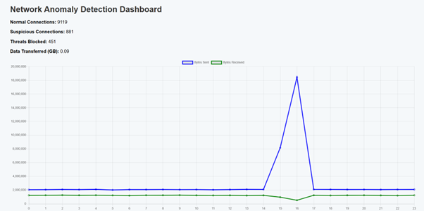
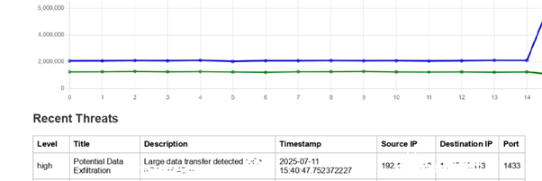

# Network Anomaly Detection System

## Overview

This project is a Flask-based web application that detects and visualizes network anomalies using machine learning algorithms. The system analyzes network traffic data, identifies suspicious patterns, and provides an interactive dashboard for monitoring network security.

## Features

- Real-time network traffic analysis
- Multiple anomaly detection algorithms:
  - Isolation Forest
  - Local Outlier Factor (LOF)
  - One-Class SVM
- Ensemble method for improved detection
- Threat classification (High, Medium, Low)
- Interactive dashboard with:
  - Connection statistics
  - Hourly traffic visualization
  - Threat distribution
  - Recent threat details

## File Structure

```
network-anomaly-detector/
├── app.py                 # Main Flask application
├── network_anomaly_detector.py  # Core anomaly detection logic
├── dashboard.html         # Dashboard template
├── static/
│   └── style.css          # Dashboard styling
└── README.md              # This file
```

## Installation

1. Clone the repository:
   ```bash
   git clone "The Link"
   cd network-anomaly-detector
   ```

2. Install required dependencies:
   ```bash
   pip install flask pandas numpy scikit-learn matplotlib seaborn
   ```

3. Run the application:
   ```bash
   python app.py
   ```

4. Access the dashboard at: `http://localhost:5000`

## Usage

1. **Dashboard**: The main dashboard shows:
   - Network connection statistics
   - Hourly traffic patterns
   - Recent threats detected





2. **API Endpoints**:
   - `/api/analyze`: Runs the analysis and returns JSON data
   - `/api/deep-analysis`: Performs additional deep analysis (placeholder)

## Configuration

The system can be configured by modifying the following in `network_anomaly_detector.py`:
- `generate_sample_data()`: Adjust sample size or anomaly ratio
- Model parameters in the training methods
- Threat classification thresholds

## Custom Data Integration

To use real network data:
1. Prepare a CSV file with network traffic data
2. Modify the `load_data()` method in `NetworkAnomalyDetector` class to match your data format
3. Update the feature selection in `preprocess_data()` as needed

## Dependencies

- Python 3.7+
- Flask
- Pandas
- NumPy
- scikit-learn
- Matplotlib
- Seaborn

